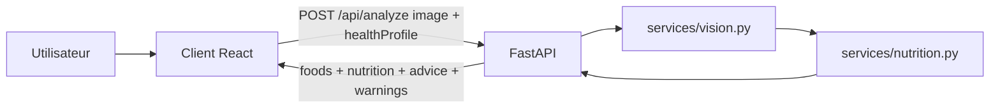

# Nutritionniste IA

Application web d'analyse de repas par photo pour le module IA & Deep Learning EFREI M2.

Le projet final traite une photo d'assiette, identifie des aliments avec un modele de vision, estime les calories et macronutriments, puis affiche des conseils adaptes au profil sante de l'utilisateur.

## Etat du projet

- Frontend : React 19 + TypeScript + Vite + Tailwind dans `client/`
- Backend : Python + FastAPI dans `backend/`
- IA vision : classifieur Food-101 via Hugging Face, avec fallback si le modele n'est pas disponible
- Nutrition : estimation par table locale, avec appel LLM optionnel si une cle API est configuree
- Ancien `server/` Node/Express : conserve comme legacy, non utilise pour le rendu final

## Architecture



Documentation detaillee : `docs/ARCHITECTURE.md`.

## Structure utile

```text
Projet_IA_Nutritionniste/
├── client/                  # Interface React
├── backend/                 # API FastAPI
│   ├── app/main.py
│   ├── app/routes/analyze.py
│   ├── app/services/vision.py
│   ├── app/services/nutrition.py
│   └── requirements.txt
├── docs/
│   ├── ARCHITECTURE.md
│   ├── PLAN_PROJET_EQUIPE.md
│   └── SOUTENANCE.md
├── docker-compose.yml
└── README.md
```

## Demarrage rapide avec Docker

Prerequis : Docker Desktop ou Docker Engine avec Docker Compose v2.

```bash
docker compose up --build
```

Services exposes :

- Frontend : http://localhost:5173
- Backend : http://localhost:8000
- Swagger FastAPI : http://localhost:8000/docs
- Healthcheck : http://localhost:8000/health

Au premier lancement, le backend peut telecharger le modele Hugging Face Food-101. Le cache est conserve dans le volume Docker `model-cache`.

### Variables optionnelles Docker

Le projet fonctionne sans cle API grace au fallback nutritionnel local. Pour activer un LLM, copier `.env.example` en `.env` a la racine et renseigner au choix :

```env
LLM_PROVIDER=mistral
MISTRAL_API_KEY=...
MISTRAL_MODEL=mistral-small-latest
```

ou :

```env
LLM_PROVIDER=openai
OPENAI_API_KEY=...
OPENAI_MODEL=gpt-4o-mini
```

Ne jamais commiter `.env`.

## Installation locale sans Docker

### Backend

Prerequis : Python 3.11+.

```bash
cd backend
python -m venv .venv
source .venv/bin/activate
pip install -r requirements.txt
uvicorn app.main:app --host 127.0.0.1 --port 8000 --reload
```

Sous Windows, si `python` n'est pas disponible :

```powershell
cd backend
py -3.12 -m venv .venv
.\.venv\Scripts\Activate.ps1
pip install -r requirements.txt
uvicorn app.main:app --host 127.0.0.1 --port 8000 --reload
```

### Frontend

Prerequis : Node.js 20.19+ et npm 11+.

```bash
cd client
npm install
npm run dev
```

Le serveur Vite proxy automatiquement `/api` et `/health` vers `http://localhost:8000`.

Pour la camera mobile en HTTPS local :

```bash
cd client
npm run dev:https
```

## Contrat API

### `POST /api/analyze`

Requete `multipart/form-data` :

| Champ | Type | Obligatoire | Description |
|---|---|---:|---|
| `image` | fichier JPEG/PNG/WebP | oui | Photo du repas, max 5 Mo |
| `healthProfile` | JSON string | non | Allergies, diabete, regime, preferences |

Exemple de reponse :

```json
{
  "success": true,
  "foods": [
    {
      "name": "pâtes",
      "confidence": 0.82,
      "portion_estimate": "moyenne"
    }
  ],
  "nutrition": {
    "calories_kcal": 520,
    "protein_g": 24,
    "carbs_g": 68,
    "fat_g": 16,
    "fiber_g": 6
  },
  "advice": "Conseils personnalises...",
  "warnings": [],
  "imageUrl": null,
  "vision_mode": "food101-hf"
}
```

## Commandes utiles

```bash
# Racine
npm run dev
npm run test:backend
npm run build:client
npm run docker:up
npm run docker:down

# Backend seul
cd backend && pytest tests -v

# Frontend seul
cd client && npm run lint
cd client && npm run build
```

## Tests et qualite

- Tests backend : `backend/tests/`
- Build frontend : `npm run build` dans `client/`
- CI GitHub : `.github/workflows/ci-cd.yml`
- Docker : `docker compose up --build`

Le build Docker client sert l'application via Nginx et proxifie `/api` vers le service backend Compose. En developpement local, Vite joue le meme role de proxy.

## Securite et donnees

- Les cles API restent cote serveur.
- Les fichiers `.env` sont ignores par Git.
- Les images sont envoyees en memoire a l'API pour analyse et ne sont pas stockees par defaut.
- Le profil sante est conserve cote navigateur par le frontend.
- Les estimations nutritionnelles sont indicatives et ne remplacent pas un avis medical.

## Limites a annoncer

- La vision repose sur Food-101 : certains plats hors vocabulaire ou tres melanges peuvent etre mal classes.
- L'application ne segmente pas chaque aliment dans l'assiette.
- Les portions sont estimees de maniere simplifiee.
- Sans cle LLM, les conseils utilisent un fallback deterministe.
- Avec cle LLM, la sortie reste controlee par validation JSON et par des alertes deterministes.

## Documentation soutenance

- Plan projet : `docs/PLAN_PROJET_EQUIPE.md`
- Architecture : `docs/ARCHITECTURE.md`
- Plan slides et FAQ technique : `docs/SOUTENANCE.md`
- Import des issues GitHub : `docs/IMPORT_ISSUES.md`

## Repartition orale recommandee

1. P1 Backend : FastAPI, route upload, validations, orchestration.
2. P2 Vision : modele Food-101, labels, limites.
3. P3 Nutrition : macros, conseils, fallback, profil sante.
4. P4 Frontend : parcours upload, resultats, historique, UX.
5. P5 DevOps & Documentation : Docker, README, CI, securite, limites et demo de lancement.
