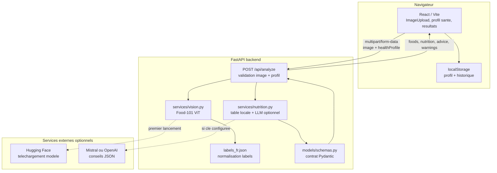
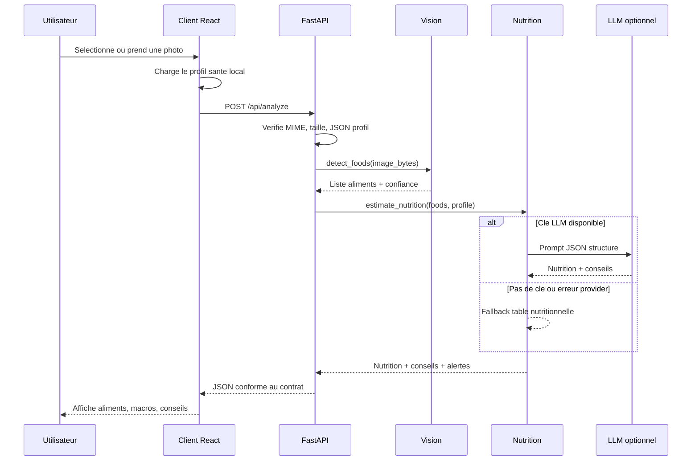
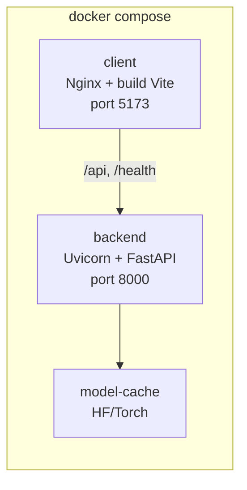

# Architecture — Nutritionniste IA

## Objectif

La version livrable analyse une photo de repas, pas une etiquette produit. Le pipeline est volontairement separe en deux briques IA :

1. Vision : detection/classification d'aliments depuis l'image.
2. Nutrition : estimation calories/macros et conseils adaptes au profil sante.

Cette separation permet d'expliquer clairement le role de chaque composant pendant la soutenance.

## Vue systeme



## Sequence d'analyse



## Ports

| Contexte | Frontend | Backend | Notes |
|---|---:|---:|---|
| Docker Compose | `localhost:5173` | `localhost:8000` | Nginx proxifie `/api` vers `backend:8000` |
| Local Vite | `localhost:5173` | `localhost:8000` | Vite proxifie `/api` et `/health` |
| HTTPS local | `https://localhost:5173` | `localhost:8000` | utile pour camera mobile |

## Contrat API

### Requete

```http
POST /api/analyze
Content-Type: multipart/form-data
```

| Champ | Format | Validation |
|---|---|---|
| `image` | JPEG, PNG ou WebP | obligatoire, max 5 Mo |
| `healthProfile` | JSON string | optionnel, `{}` si absent ou invalide |

### Reponse

```json
{
  "success": true,
  "foods": [
    {
      "name": "riz",
      "confidence": 0.87,
      "portion_estimate": "moyenne"
    }
  ],
  "nutrition": {
    "calories_kcal": 520,
    "protein_g": 35,
    "carbs_g": 40,
    "fat_g": 18,
    "fiber_g": 5
  },
  "advice": "Conseils personnalises...",
  "warnings": [],
  "imageUrl": null,
  "vision_mode": "food101-hf"
}
```

## Backend

### `app/main.py`

- Initialise FastAPI.
- Configure CORS via `ALLOWED_ORIGINS`.
- Expose `/health`.
- Monte les routes sous `/api`.

### `app/routes/analyze.py`

- Recoit l'image en `multipart/form-data`.
- Refuse les formats non image.
- Limite la taille a 5 Mo.
- Parse le profil sante.
- Orchestre vision puis nutrition.

### `app/services/vision.py`

- Utilise `vishnudas08/food101-vit-model`.
- Retourne un top-k d'aliments avec score de confiance.
- Normalise certains labels anglais vers des labels francais.
- Retourne un fallback `assiette` si le modele n'est pas charge.

### `app/services/nutrition.py`

- Calcule un fallback par table nutritionnelle locale.
- Genere des alertes deterministes selon allergies, diabete, regimes.
- Peut appeler Mistral ou OpenAI si les variables d'environnement sont presentes.
- Force une sortie structuree et revient au fallback en cas d'erreur provider.

## Frontend

Le frontend conserve les briques utiles de l'ancien projet :

- `ImageUpload` pour camera/import.
- `HealthProfileSetup` pour le profil sante.
- `AnalysisResults` pour aliments, macros, conseils et alertes.
- `History` pour l'historique local.

`client/src/services/api.ts` envoie l'image et le profil a `/api/analyze`. En local et en Docker, l'URL reste relative pour passer par le proxy Vite/Nginx.

## Docker



Fichiers :

- `docker-compose.yml`
- `backend/Dockerfile`
- `client/Dockerfile`
- `client/nginx.conf`
- `.env.example`

## Securite

- Les cles API ne sont jamais envoyees au frontend.
- `.env`, `.env.local` et variantes sont ignores.
- Les images ne sont pas persistees par l'API.
- CORS est limite aux origines locales utiles pour le developpement et Docker.

## Limites techniques

- Food-101 contient 101 classes : les plats hors vocabulaire peuvent etre approximes.
- Le projet ne fait pas de segmentation d'assiette ni d'estimation volumetrique precise.
- Les portions sont simplifiees avec `portion_estimate`.
- Les conseils ne constituent pas un diagnostic medical.
- Le premier lancement avec modele HF peut etre lent car il telecharge les poids.

## Verification locale

```bash
docker compose up --build
```

Puis ouvrir :

- http://localhost:5173
- http://localhost:8000/docs

Sans Docker :

```bash
cd backend
uvicorn app.main:app --host 127.0.0.1 --port 8000 --reload

cd client
npm run dev
```

Tests backend :

```bash
cd backend
pytest tests -v
```
