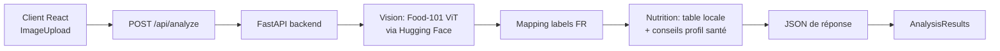

# Architecture actuelle — Nutritionniste IA

## Objectif du rendu

Le projet final ne doit plus analyser des étiquettes produits. La version actuelle analyse une photo d'assiette, détecte des aliments courants, puis estime des macros et génère des conseils personnalisés.

## Chaîne de traitement



## Choix du modèle vision

- Modèle principal: `vishnudas08/food101-vit-model` (Vision Transformer finement ajusté sur Food-101).
- Pourquoi ce choix: il est spécialisé dans les plats et bien plus pertinent qu’un modèle généraliste ImageNet pour des cas comme `riz`, `frites`, `pâtes`, `pizza`.
- Fallback: si le modèle ne charge pas, l’API renvoie une réponse minimale au lieu d’une 500, mais ce cas doit rester exceptionnel.

## Dataset et métriques

- Dataset d'entraînement annoncé par la carte modèle: `Food-101`.
- Taille annoncée: 75 000 images d'entraînement, 101 classes.
- Métrique annoncée par la carte modèle: environ 90% de validation accuracy.
- Point important à dire au prof: cette métrique vient de la carte du modèle Hugging Face, elle n'a pas été recalculée localement pendant le projet.

## Ce que l'on considère comme réussi

- Pour une assiette de pâtes, la sortie doit remonter `pâtes` en premier.
- La réponse API doit inclure `vision_mode=food101-hf`.
- Le frontend affiche les aliments, les macros, les conseils et les alertes de profil santé.

## Limites à annoncer en soutenance

- Le détecteur vision reste une approximation.
- Le modèle est spécialisé Food-101, donc certains plats hors vocabulaire ou mélanges complexes peuvent encore être mal étiquetés.
- Les estimations de portion et de calories sont indicatives, pas médicales.
- La solution ne fait pas d'analyse par segmentation d'assiette.

## Vérification locale

```powershell
cd backend
& "C:\Program Files\Python312\python.exe" scripts/test_vision.py tests/plate.jpg
& "C:\Program Files\Python312\python.exe" -m uvicorn app.main:app --host 127.0.0.1 --port 8001
```
